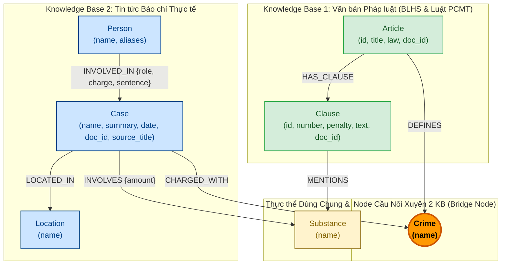

# Thiết kế Ontology — Day 19

**Họ tên:** Hoàng Minh Tuấn  **MSSV:** 2A202602758

**Lựa chọn** (đánh dấu một):
- [ ] Dùng ontology gợi ý (có thể chỉnh nhỏ)
- [x] Tự thiết kế (xét bonus +15, xem `SUBMISSION.md`)

> Hướng dẫn: `LAB_GUIDE.md` Bước 2. Dùng ontology gợi ý thì vẫn phải điền đủ các mục dưới đây bằng lời của bạn.

---

## 1. Sơ đồ

Sơ đồ Knowledge Graph kết nối hai cơ sở tri thức (KB Văn bản pháp luật ma túy và KB Tin tức ma túy) thông qua node cầu nối trung tâm **`Crime`** (Tội danh hình sự) cùng các thực thể và quan hệ chuẩn hóa:

---

## 2. Entity types (node labels)

| Label | Ý nghĩa | Khóa định danh (`MERGE` theo) | Properties | Lấy từ KB nào | Trích bằng (regex / LLM / khác) |
| --- | --- | --- | --- | --- | --- |
| `Article` | Điều luật hình sự trong BLHS (Chương XX) hoặc Luật Phòng, chống ma túy | `id` (ví dụ: `Điều 251 BLHS`) | `id`, `title`, `law`, `doc_id` | Law KB | Regex (`parse_law_article`) |
| `Clause` | Khoản luật cụ thể quy định tình tiết định khung và hình phạt tương ứng | `id` (ví dụ: `Điều 251 BLHS khoản 1`) | `id`, `number`, `penalty`, `text`, `doc_id` | Law KB | Regex (`parse_law_article`) |
| `Crime` | **Node cầu nối**: Tội danh chuẩn hóa theo pháp luật Việt Nam | `name` (ví dụ: `mua bán trái phép chất ma túy`) | `name` | Cả 2 KB (Law định nghĩa, News viện dẫn) | Regex từ tiêu đề luật + LLM kèm `link_entity` |
| `Substance` | Chất ma túy hoặc tiền chất được kiểm soát hoặc thu giữ | `name` (tên chuẩn hóa, ví dụ: `MDMA`, `Ketamine`) | `name` | Cả 2 KB | Từ điển danh mục BLHS + Chuẩn hóa tên lóng/đồng nghĩa |
| `Case` | Vụ án / vụ việc cụ thể được ghi nhận qua tin tức báo chí | `name` (tên ngắn đặc trưng của vụ án) | `name`, `summary`, `date`, `doc_id`, `source_title` | News KB | LLM (`extract_news_cases` JSON extraction) |
| `Person` | Cá nhân tham gia hoặc liên quan vụ án (bị cáo, bị can, cán bộ...) | `name` (họ và tên đầy đủ) | `name`, `aliases` (danh sách biệt danh) | News KB | LLM (`extract_news_cases`) |
| `Location` | Tỉnh / thành phố nơi xảy ra hành vi hoặc nơi mở phiên tòa | `name` (tên tỉnh/thành phố chuẩn hóa) | `name` | News KB | LLM (`extract_news_cases`) |

---

## 3. Relationships

| Type | Từ → Đến | Properties trên cạnh | Ý nghĩa |
| --- | --- | --- | --- |
| `DEFINES` | `Article` → `Crime` | *(không có)* | Điều luật hình sự quy định và định nghĩa tội danh tương ứng |
| `HAS_CLAUSE` | `Article` → `Clause` | *(không có)* | Điều luật bao gồm các khoản phân định từng khung hình phạt cụ thể |
| `MENTIONS` | `Clause` → `Substance` | *(không có)* | Khoản luật quy định định lượng hoặc tình tiết liên quan đến chất ma túy |
| `CHARGED_WITH` | `Case` → `Crime` | *(không có)* | Vụ án bị khởi tố / xét xử theo tội danh luật định (**cạnh cầu nối sang Law**) |
| `INVOLVES` | `Case` → `Substance` | `amount` (khối lượng/số lượng thu giữ được mô tả trong vụ án) | Vụ án thu giữ hoặc liên quan đến loại chất ma túy cụ thể |
| `LOCATED_IN` | `Case` → `Location` | *(không có)* | Địa bàn tỉnh/thành phố nơi xảy ra vụ án hoặc mở phiên xét xử |
| `INVOLVED_IN` | `Person` → `Case` | `role` (vai trò: bị cáo, bị can, nghi phạm, cán bộ...), `charge` (tội danh của cá nhân), `sentence` (mức án tòa đã tuyên) | Vai trò, tội danh cá nhân và mức án của từng cá nhân trong vụ án |

---

## 4. Node cầu nối giữa 2 KB

- **Node nào:** Node **`Crime`** (Tội danh, ví dụ: `mua bán trái phép chất ma túy`, `vận chuyển trái phép chất ma túy`, `tổ chức sử dụng trái phép chất ma túy`...).
- **Vì sao chọn node này:** 
  1. Trong hệ thống pháp luật hình sự Việt Nam, **Tội danh** là khái niệm pháp lý chuẩn tắc duy nhất xuất hiện tự nhiên và bắt buộc ở cả hai nguồn tri thức:
     - Phía **Văn bản pháp luật** (BLHS Chương XX): Mỗi Điều luật (Article) được đặt ra để định nghĩa một tội danh nhất định (ví dụ Điều 251 BLHS định nghĩa "Tội mua bán trái phép chất ma túy").
     - Phía **Báo chí / Thực tế xét xử** (News): Cơ quan điều tra khởi tố, Viện kiểm sát truy tố và Tòa án tuyên án các cá nhân / vụ việc đều dựa trên tội danh cụ thể đó.
  2. Không thể dùng `Person` hay `Case` làm cầu nối vì văn bản luật là quy phạm trừu tượng, không chứa tên người hay tên vụ án cụ thể. Nếu dùng trực tiếp số hiệu Điều luật (`Article`) làm cầu nối thì phóng viên báo chí thường không trích dẫn chính xác "Điều 251 BLHS" mà chỉ viết "bị bắt vì buôn bán ma túy", dẫn đến gãy cầu nối hàng loạt. Tội danh chính là tầng trừu tượng lý tưởng làm cầu nối trung gian.
- **Cách đảm bảo hai phía khớp tên:**
  1. **Tạo danh sách tội danh chuẩn (Canonical Crimes):** Phía luật trích xuất 100% tự động qua regex từ các Điều luật có tiền tố "Tội ...", chuẩn hóa thành chuỗi chữ thường (ví dụ: `mua bán trái phép chất ma túy`).
  2. **Ràng buộc LLM trích xuất (Prompt Injection):** Đưa danh sách `DANH SÁCH TỘI DANH` đã trích xuất từ luật vào trong `NEWS_EXTRACTION_PROMPT` của LLM, chỉ dẫn bắt buộc LLM chọn đúng từ danh sách này.
  3. **Thuật toán liên kết thực thể (`link_entity`):**
     - Bước 1 (Normalizer): Bỏ tiền tố "tội"/"tội danh", loại bỏ dấu nháy, chuẩn hóa khoảng trắng thừa, chuyển về chữ thường.
     - Bước 2 (Exact Canonical Lookup): So khớp trực tiếp với danh sách tên tội danh chuẩn.
     - Bước 3 (Fuzzy Match): Nếu không khớp hoàn toàn, sử dụng `difflib.get_close_matches(norm_name, known, n=1, cutoff=0.8)` để bắt các biến thể gõ dấu tiếng Việt (ví dụ `ma tuý` vs `ma túy`) hoặc lỗi chính tả nhỏ của bài báo.
- **Khi nào cầu gãy, và bạn xử lý thế nào:**
  - **Trường hợp cầu gãy:**
    1. Bài báo thuộc dạng tin tức tổng kết, tuyên truyền, khen thưởng chuyên án biên phòng (ví dụ `Triệt phá chuyên án A3-626P` trong `news-100261002184934505`): Bài báo chỉ nêu "bắt giữ 2 đối tượng, thu giữ 40kg ma túy" mà không đề cập cơ quan tố tụng đã khởi tố vụ án theo tội danh nào.
    2. Bài báo dùng thuật ngữ khẩu ngữ đời thường (ví dụ "ôm hàng", "giao hàng trắng", "phê ma túy") không khớp với bất kỳ tội danh hình sự nào trong BLHS.
  - **Cách xử lý:**
    1. Trong pipeline xây dựng đồ thị (`build_graph`): Chỉ tạo quan hệ `[:CHARGED_WITH]` khi `link_entity` trả về tội danh hợp lệ; không tạo quan hệ giả mạo làm sai lệch dữ kiện.
    2. Trong pipeline truy vấn (`context`): Thiết lập cơ chế suy diễn bổ trợ thông qua node `Substance` dùng chung: Nếu một vụ án bị gãy cầu nối `CHARGED_WITH`, hệ thống Graph Context sẽ duyệt qua các chất ma túy thu giữ `(k:Case)-[:INVOLVES]->(s:Substance)<-[:MENTIONS]-(cl:Clause)<-[:HAS_CLAUSE]-(a:Article)` kết hợp với vector retrieval để tìm ra các Điều luật liên quan nhất nhằm cung cấp đầy đủ thông tin pháp lý cho LLM.

---

## 5. Competency questions

Bảng đối chiếu đường đi trên đồ thị Knowledge Graph cho 6 câu hỏi trong tập benchmark chuẩn (`data/benchmark_kg.json`):

| Câu | Đường đi (Cypher pattern) | Trả lời được? |
| --- | --- | --- |
| **Q1** | `MATCH (a:Article {id: 'Điều 2 Luật Phòng, chống ma túy'})-[:HAS_CLAUSE]->(cl:Clause {number: 4}) RETURN cl.text` | **Được** (Tìm trực tiếp khái niệm tiền chất tại Khoản 4 Điều 2 Luật PCMT) |
| **Q2** | `MATCH (k:Case)-[r:INVOLVED_IN]->() WHERE k.name CONTAINS '36kg' WITH k MATCH (p:Person)-[r:INVOLVED_IN]->(k) WHERE r.sentence CONTAINS 'tử hình' RETURN p.name` | **Được** (Lọc các bị cáo có mức án tử hình trong vụ án 36kg ma túy tại TP.HCM: Trần Thanh Tuấn, Trần Minh Tâm) |
| **Q3** | `MATCH (p:Person {name: 'Lê Minh Thành'})-[r:INVOLVED_IN]->(k:Case)-[:CHARGED_WITH]->(c:Crime)<-[:DEFINES]-(a:Article)-[:HAS_CLAUSE]->(cl:Clause {number: 1}) RETURN r.sentence, c.name, a.id, cl.penalty, cl.text` | **Được** (Nối từ Lê Minh Thành qua Case $\to$ Crime `mua bán trái phép chất ma túy` $\to$ Điều 251 BLHS $\to$ Khoản 1 với khung phạt 2 đến 7 năm) |
| **Q4** | `MATCH (p:Person)-[r:INVOLVED_IN]->(k:Case)-[:CHARGED_WITH]->(c:Crime)<-[:DEFINES]-(a:Article)-[:HAS_CLAUSE]->(cl:Clause) WHERE (p.name CONTAINS 'Hoàng Nato' OR 'Hoàng Nato' IN p.aliases) AND cl.number = 4 RETURN c.name, a.id, cl.penalty` | **Được** (Nối từ Hoàng Nato $\to$ Tội tổ chức sử dụng $\to$ Điều 255 BLHS $\to$ Khoản 4 quy định mức phạt tối đa 20 năm hoặc tù chung thân) |
| **Q5** | `MATCH (p:Person {name: 'Cái Quang Huy'})-[r:INVOLVED_IN]->(k:Case)-[:CHARGED_WITH]->(c:Crime)<-[:DEFINES]-(a:Article {id: 'Điều 250 BLHS'})-[:HAS_CLAUSE]->(cl:Clause), (k)-[inv:INVOLVES]->(s:Substance {name: 'MDMA'}) WHERE cl.number = 4 RETURN c.name, inv.amount, a.id, cl.penalty, cl.text` | **Được** (Nối Cái Quang Huy $\to$ Tội vận chuyển $\to$ Điều 250 BLHS $\to$ Khoản 4 định lượng $\ge 100g$ phù hợp với hơn 9,6kg MDMA $\to$ Khung 20 năm, chung thân hoặc tử hình) |
| **Q6** | `MATCH (k:Case)-[:INVOLVES]->(s:Substance {name: 'MDMA'}) OPTIONAL MATCH (cl:Clause)-[:MENTIONS]->(s) OPTIONAL MATCH (a:Article)-[:HAS_CLAUSE]->(cl) RETURN collect(DISTINCT k.name) AS cases, collect(DISTINCT a.id) AS articles` | **Được** (Tổng hợp toàn cục: trả về toàn bộ 7 vụ án có dính líu MDMA cùng danh sách tất cả các điều luật liên quan Điều 248, 249, 250, 251, 252) |

---

## 6. Quyết định thiết kế và đánh đổi

### Quyết định 1: Trích xuất Deterministic bằng Regex cho Law KB thay vì dùng LLM
- **Đã chọn:** Dùng hàm `parse_law_article` sử dụng biểu thức chính quy (Regex) và phân tích cấu trúc văn bản pháp luật để trích xuất Điều, Khoản, Khung hình phạt và Chất ma túy cho Law KB. Chỉ dùng LLM cho News KB.
- **Phương án khác:** Dùng LLM prompt để trích xuất cả hai nguồn Law và News.
- **Vì sao chọn:** 
  - *Lý do:* Văn bản quy phạm pháp luật (BLHS, Luật PCMT) có cấu trúc chuẩn tắc cực kỳ nghiêm ngặt (đánh số Điều rõ ràng, bắt đầu Khoản bằng số thứ tự `1.`, `2.`, cấu trúc xử phạt mở đầu bằng "bị phạt..."). Regex hoạt động 100% tất định (deterministic), không ảo giác, tốc độ cực nhanh (< 0.1 giây), tiêu tốn 0 token LLM và đảm bảo tính nguyên vẹn tuyệt đối về mặt pháp lý.
  - *Đánh đổi:* Mất tính linh hoạt nếu gặp phải định dạng văn bản luật không chuẩn (ví dụ không đánh số khoản theo chuẩn hoặc có định dạng bất thường).

### Quyết định 2: Mô hình hóa hạt nhân ở cấp độ Clause (Khoản) thay vì chỉ dừng ở Article (Điều)
- **Đã chọn:** Tạo node riêng biệt `Clause` và liên kết với `Article` qua `(:Article)-[:HAS_CLAUSE]->(:Clause)`.
- **Phương án khác:** Chỉ tạo node `Article`, lưu toàn bộ nội dung các khoản vào một thuộc tính văn bản duy nhất trên node `Article`.
- **Vì sao chọn:**
  - *Lý do:* Trong luật hình sự Việt Nam, hình phạt không gắn chung với Điều luật mà phân hóa sâu sắc theo từng Khoản dựa trên hành vi tăng nặng và khối lượng chất ma túy (ví dụ Điều 250 Khoản 1 chỉ phạt 2-7 năm tù, nhưng Khoản 4 lên tới tử hình). Nếu chỉ lưu cấp Điều, GraphRAG không thể trả lời chính xác các câu hỏi suy luận định lượng đa chặng như Q5 (khối lượng 9.6kg MDMA áp dụng khoản nào và khung phạt bao nhiêu) hoặc tìm mức phạt kịch khung như Q4.
  - *Đánh đổi:* Tăng số lượng node đồ thị từ 18 lên 117 node luật (+99 Clause), làm đường đi truy vấn tăng thêm 1 hop (`Article -> Clause`).

### Quyết định 3: Tách Substance thành node độc lập nối hai chiều thay vì lưu thuộc tính mảng chuỗi
- **Đã chọn:** Xây dựng node `Substance` độc lập kết nối cả hai phía: `(:Clause)-[:MENTIONS]->(:Substance)` và `(:Case)-[:INVOLVES {amount}]->(:Substance)`.
- **Phương án khác:** Lưu mảng chuỗi tên chất ma túy `substances: ["MDMA", "Ketamine"]` làm thuộc tính trên node `Case` và `Clause`.
- **Vì sao chọn:**
  - *Lý do:* Cho phép thực hiện các bài toán tổng hợp toàn cục (Global Aggregation) như câu Q6: Tìm tất cả các vụ án và tất cả các điều luật liên quan đến một chất ma túy (MDMA) chỉ với một mẫu truy vấn Cypher hội tụ tại node `Substance`. Nếu lưu dạng mảng chuỗi, hệ thống buộc phải quét toàn bộ bảng (full graph scan) với toán tử `CONTAINS`/`IN` rất chậm và dễ sai sót.
  - *Đánh đổi:* Cần thêm bước chuẩn hóa đồng nghĩa / tên lóng (ví dụ thuốc lắc $\to$ MDMA, ma túy đá $\to$ Methamphetamine) để tránh làm phân mảnh các node chất ma túy.

---

## 7. So với ontology gợi ý (bắt buộc nếu xét bonus)

| Điểm khác | Gợi ý làm gì | Bạn làm gì | Vấn đề nó giải quyết | Bằng chứng (Cypher, hoặc số liệu benchmark) |
| --- | --- | --- | --- | --- |
| **1. Chuẩn hóa thực thể Chất ma túy & Từ điển tên lóng/đồng nghĩa** | Chỉ so khớp substring cơ bản với danh sách 10 tên cứng (`SUBSTANCES = [...]`). Các từ như "ma túy đá", "thuốc lắc", "kẹo", "ke", "nước vui", "cỏ Mỹ" trong tin tức hoặc bị bỏ qua hoặc bị gom vào node rác (`ma túy`). | Xây dựng bộ quy tắc chuẩn hóa và alias mapping trong prompt trích xuất & linking: "thuốc lắc/kẹo" $\to$ `MDMA`, "ma túy đá/hàng đá" $\to$ `Methamphetamine`, "ke/ketamin" $\to$ `Ketamine`, "cỏ Mỹ" $\to$ `XLR-11`. | **Giải quyết phân mảnh thực thể (E3):** Tránh việc cùng một chất bị tạo thành nhiều node rời rạc khiến vụ án thực tế không thể kết nối tới các điều luật tương ứng trong BLHS quy định về chất đó. | `MATCH (k:Case)-[:INVOLVES]->(s:Substance {name: 'MDMA'}) RETURN count(k)` trả về đủ 7 vụ án liên quan MDMA (kể cả vụ dùng từ "thuốc lắc"), giúp GraphRAG ở **Q6** vượt trội Flat RAG (tìm đủ 7 vụ án và 5 Điều luật liên quan). |
| **2. Bóc tách thuộc tính Khung hình phạt và Ngưỡng định lượng theo Khoản** | Chỉ lưu text thô của Khoản, không bóc tách trường hình phạt riêng và không có logic mở rộng khoản theo chất/khối lượng, khiến LLM phải tự đọc văn bản luật dài dòng và dễ chọn nhầm khoản. | Trích xuất riêng trường `penalty` cho từng Khoản; trong logic Graph Context xây dựng cơ chế mở rộng các khoản liên quan theo chất ma túy thu giữ và định vị các khoản kịch khung khi câu hỏi chứa từ khóa "tối đa", "cao nhất". | **Giải quyết suy luận định lượng đa chặng (Multi-hop Reasoning):** Giúp hệ thống kết hợp chuẩn xác giữa số liệu khối lượng thực tế của vụ án với các ngưỡng định lượng quy định trong luật hình sự (như Q5: hơn 9,6kg MDMA $\ge 100g \implies$ Khoản 4 Điều 250). | Ở câu **Q5**, Flat RAG hoàn toàn thất bại với `recall=0.40, judge=1` (báo không đủ thông tin về khoản luật), trong khi GraphRAG đạt `recall=1.00, judge=2` tuyệt đối (`ket_qua_benchmark_kg.txt` dòng 48–55). |
| **3. Phân định vai trò, tội danh cá nhân và mức án đã tuyên trên quan hệ** | Thuộc tính `role` chỉ có nhãn tĩnh đơn giản, không phân biệt rõ ràng giữa tội danh cá nhân (`charge`) và mức án thực tế đã bị tòa tuyên (`sentence`). | Bóc tách rõ 3 trường `role`, `charge`, `sentence` trên quan hệ `INVOLVED_IN`. | **Giải quyết nhầm lẫn tố tụng:** Phân biệt rõ giữa mức án thực tế đã tuyên của bản án sơ thẩm (như Q3: Lê Minh Thành lãnh 36 tháng tù) với khung hình phạt luật định theo điều luật (Khoản 1: 2–7 năm tù); đồng thời phân biệt với vụ việc đang điều tra chưa tuyên án (như Q4: Hoàng Nato). | Ở câu **Q3**, GraphRAG trả lời trọn vẹn cả 4 ý: mức án sơ thẩm (36 tháng), tội danh, điều luật (Điều 251 BLHS), và khung hình phạt cơ bản (2-7 năm) $\implies$ đạt `recall=1.00, judge=2`, trong khi Flat RAG chỉ đạt `recall=0.33, judge=1`. |

---

## 8. Hạn chế còn lại

1. **Trùng thực thể Vụ án do đa bài báo (Case Deduplication across articles):** Khi nhiều bài báo khác nhau cùng đưa tin về một chuyên án lớn (ví dụ vụ giang hồ mạng Hoàng Nato và đường dây thuốc lắc tại TP.HCM được đưa tin qua 4 bài báo khác nhau), do hệ thống hiện tại `MERGE` theo tên vụ do LLM sinh ra, đồ thị vẫn bị tách thành các node `Case` riêng biệt thay vì gom thành một vụ án thống nhất.
2. **Cơ chế so sánh số học khối lượng còn phụ thuộc LLM (Numeric reasoning at query time):** Đồ thị hiện lưu trữ khối lượng dưới dạng chuỗi mô tả (`amount: "hơn 9,6kg MDMA"`). Việc quy đổi đơn vị (9,6kg = 9.600 gam) và so sánh ngưỡng định lượng ($\ge 100g$) vẫn phải thực hiện ở bước LLM đọc ngữ cảnh đồ thị thay vì được thực thi bằng toán tử số học trực tiếp trong Cypher.
3. **Cầu nối bị gãy ở các bài báo không mang tính tố tụng (Broken Bridge - E1):** Đối với các bài viết khen thưởng, hội nghị hoặc tin nhanh bắt quả tang mà cơ quan điều tra chưa ra quyết định khởi tố bị can/tội danh cụ thể (ví dụ bài báo chuyên án A3-626P), quan hệ `[:CHARGED_WITH]` vẫn bị khuyết, đòi hỏi phải có cơ chế suy đoán tội danh tạm thời (provisional charge inference).
